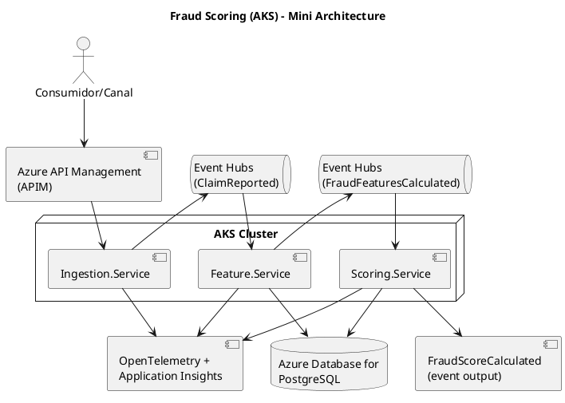

## Objetivo general
Diseñar e implementar una plataforma **cloud-native** de **fraud/risk scoring (0–100)** para seguros, basada en microservicios .NET en **AKS** y un pipeline **event-driven/streaming** con **Azure Event Hubs**, priorizando:
- escalabilidad y resiliencia,
- **observabilidad distribuida** (tracing end-to-end),
- y persistencia/auditoría mínima en **PostgreSQL managed**.

Repositorio: https://github.com/diegoquinonez1/fraud-cloudnative-aks

---

## Caso de negocio (seguro)
A partir de eventos (por ejemplo, “reclamo reportado”), el sistema calcula un **riesgo de fraude**:
- genera features simples (monto, frecuencia, canal, antigüedad póliza, completitud documental),
- calcula un score 0–100,
- persiste el resultado y lo expone para consulta y auditoría.

---

## Arquitectura (mini-diagrama)

---

## Componentes principales
- **API Gateway**: Azure API Management (APIM)
- **Compute**: AKS (microservicios .NET)
- **Streaming**: Azure Event Hubs (consumer groups)
- **Datos**: Azure Database for PostgreSQL (managed)
- **Observabilidad**: OpenTelemetry + Application Insights / Azure Monitor
- **Infra as Code**: Terraform

---

## Qué demuestra (como Solutions Architect)
- Trade-offs reales: **AKS vs PaaS**, y **Event Hubs vs Service Bus**.
- Event streaming: consumer groups, estrategia de consumo, idempotencia (tabla `processed_events`), versionado de eventos.
- Observabilidad moderna: trazas distribuidas, correlación entre servicios y medición de latencia del pipeline.
- Diseño orientado a evolución: el scoring heurístico v1 deja el camino listo para un modelo ML en v2.

---

## Roadmap v1 (MVP)
1) Ingestion publica `ClaimReported` a Event Hubs
2) Feature-service consulta Postgres y emite `FraudFeaturesCalculated`
3) Scoring-service calcula score 0–100, persiste y emite `FraudScoreCalculated`
4) Tracing end-to-end con OpenTelemetry
